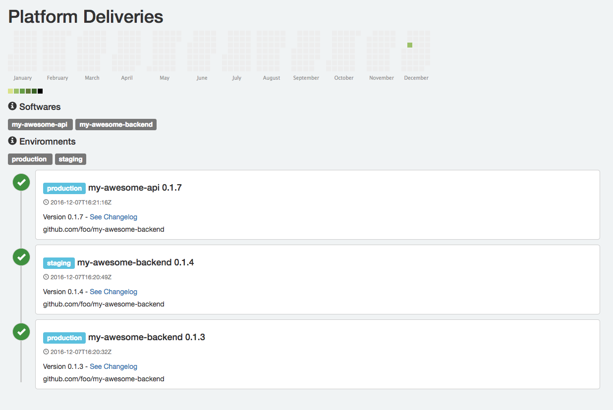

# Golive [](https://travis-ci.org/alexjomin/golive)

## Description

With **golive**, keep track of your deliveries.

### what, when and where ?

In a continious deployment workflow, it's sometimes difficult to remember **which** software has been deployed, **when** and **where**. golive offers a dead simple api to record and retrieve your deliveries, it also come with a frontend to display the timeline with a heatmap.

## Screenshot



## Features

* Dead simple HTTP API, written in Go.
* Web dashboard based on Vue.js and Bootstrap :
	* Timeline of your deployments
	* List of the softwares, with filter.
	* List of the environments, with filter.
	* HeatMap, github style.
* Included database : [Bolt](https://github.com/boltdb/bolt).
* Super easy to install !

## Install
This project uses [Glide](https://github.com/Masterminds/glide), a Vendor Package Management
	
	glide install
	make build

## Start

	golive /tmp/db 8080
	
First Parameter is the path to the database (default is `./db`) and second is the port of the webserver (default is `80`).

Golive persitance is based on [Bolt](https://github.com/boltdb/bolt), a pure Go key/value store. No need to install an extra database. Dead simple I was saying !

## Docker

An image is available here : https://hub.docker.com/r/alexandrejomin/golive/

Work in progress.

## API

### `POST` /api/deliveries

**payload :**

```
{
    "software": "delta",
    "version": "0.1.3",
    "environment": "production",
    "repository": "github.com/foo/my-awesome-backend"
}
```

### `GET` /api/deliveries
### `GET` /api/deliveries/:id
### `GET` /api/heatmap
